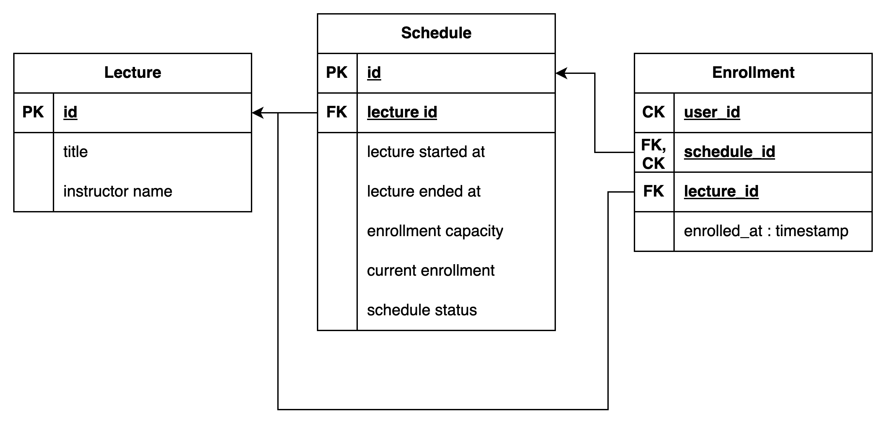

### migration 파일 생성
1. npm run build
2. npm run migration:generate migrations/<마이그레이션 파일 명>

-------

### 모델링
- 특강 (객체)
    - 특강 신청시 : ID
    - 특강 조회시 : 이름
    - 특강 조회시 : 일자
    - 특강 조회시 : 강연자 정보
    - 특강 신청, 조회시 : 정원 수
    - 특강 신청시 : 검증시) join으로 하면 부하가 예상되어서 수강자수
- 수강 (관계)
    - 특강 신청, 특강 신청 완료 목록 조회 : 사용자 Id
    - 특강 신청 : 특강 Id
    - 특강 신청 : 수강 신청 완료 시간
- 유저 (객체) (이번 과제에서는 생략)

> Q1. 정원수를 어플리케이션에서 처리하지 않고 객체에 넣은 이유?  
> A1. 특강 일자 별 정원수는 달라질 수도 있다고 생각해서 객체의 속성으로 봤습니다

> Q2. 특강에 수강자수를 넣은 이유  
> A2. 현재 수강자수는 실시간으로 달라지는 정보임으로 객체의 속성으로 봤습니다

 

### ERD

  

1. 모델링의 특강이 Lecture, Schdule로 나뉘게 된 이유   
기존에 저는 특강이라면 연사를 초청해서 한 번밖에 하지 않는 강의라고
생각을 하고 있었는데
같은 주제로 여러 타임에 특강을 진행할 수 있다고 생각이 변하게 되어서 테이블을 분리하게 되었습니다

2. Enrollment lecture_id 있는 이유  
    특강 신청 완료 목록 조회 API시 Enrollment와 schedule을 join하는 것이 아니라 아니라 바로 lecture와 join 할 수 있도록 최적화
3. schedule에 current enrollment 있는 이유  
  특강 신청 가능 목록 조회 API시 성능 최적화를 위해 join을 통해 연산후 현재 인원수를 보여주는 것이 아니라 바로 조회할 수 있도록 최적화
4. schedule에 lectureDate 없는 이유  
   저는 lectureDate는 staredAt에 날짜와 동일하지 않나 라고 생각해서 삭제했습니다
5. schedule에 scheduleStatus가 있는 이유  
   기존의 설계에는 현재 수강수와 최대 인원을 속성으로 가지고 있고 조회시 계산할 예정이었으나 조회시 성능 최적화를 위해 데이터 조작시 정원 초과됐는지의 상태를 계산하여 scheduleStatus를 변경하는 방법 채택했습니다